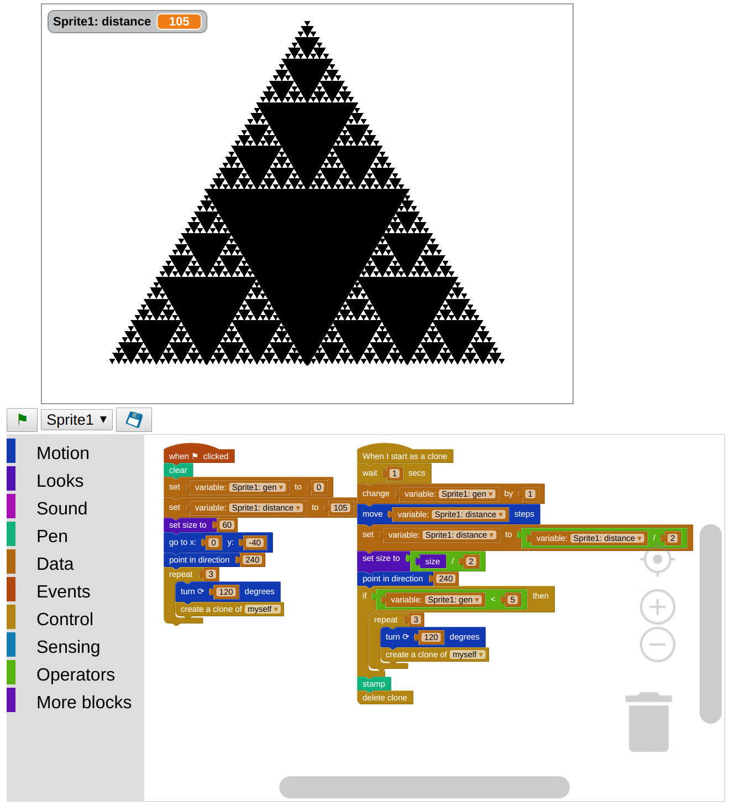

# About #
Argon is a web-based visual editor for Scratch files.  Its aim is to replace the flash-based web editor. It is based on Blockly, which is a Google project for visual programming.  It also relies on Sulfurous, for the HTML5 player. Sulfurous was created by Mittagskogel and is based off Phosphorus, which was created by Nathan Dinsmore. Its CPS-style compilation and overall design was inspired by Rhys Simpson's sb2.js. It would have more bugs if not for Truman Kilen. It uses the JSZip library, created by Stuart Knightley, David Duponchel, Franz Buchinger, and António Afonso, to read .sb2 files and compressed projects, and the canvg library, created by Gabe Lerner, to render SVGs in canvas elements.

# Status #
Argon is actively developed, as of the Summer of 2017 by Jeffrey Gordon.  Currently, the goal is to render the scripts for any SB2 file in the Blockly editor. 

[Development Video](https://www.youtube.com/watch?v=grpiT5QoRTk)

Script example: 

# Code #
The source code for phosphorus and sulfurous are available on GitHub.